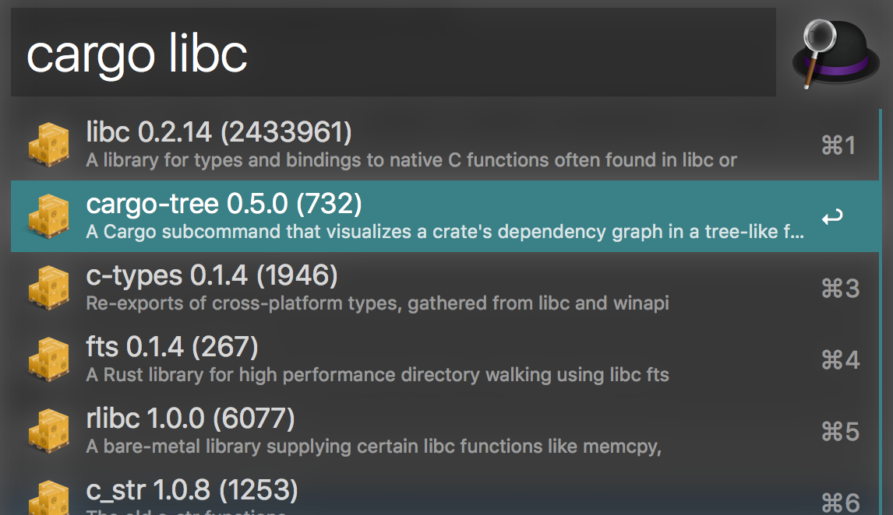

# alfred-cargo

> [Alfred 3](https://www.alfredapp.com) workflow to search for cargo packages with [crates.io](https://crates.io/)

## Install

[Install the workflow.](http://www.packal.org/workflow/cargo)

*Requires [Node.js](https://nodejs.org) 4+ and the Alfred [Powerpack](https://www.alfredapp.com/powerpack/).*

## Usage

In Alfred, type `cargo`, <kbd>Enter</kbd>, and your query, to search for packages.

## License

MIT
